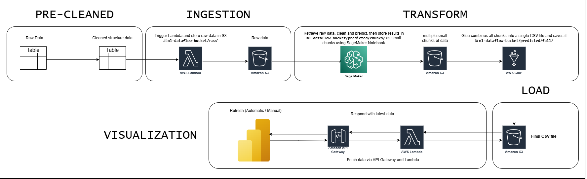

## 📊 Project Architecture Overview

This project follows a modular ETL + ML pipeline designed for fraud prediction and visualization using AWS services.

---

### 🧱 Pipeline Stages

### ✅ 1. PRE-CLEANED  
Before entering AWS, all datasets are cleaned and structured locally using custom preprocessing scripts:

- `clean_test_for_prediction.py`  
  → Cleans and prepares the **test set** for model inference.
- `clean_train_for_model_training.py`  
  → Cleans and structures the **training set** for CatBoost model training.
- `extract_train_for_visualization.py`  
  → Extracts a subset of training data used for **Power BI visualization**.

The result is a well-defined and consistently formatted dataset ready for ingestion into AWS.

### ✅ 2. INGESTION  
Processed data is uploaded into AWS S3 using a Lambda function:

- `sent_payload_lambda.py`  
  → Uploads cleaned `.parquet` files to `s3://ml-dataflow-bucket/raw/`

This step ensures that data is centralized in S3 for processing by downstream services.

### ✅ 3. TRANSFORM  
- **SageMaker Notebook** retrieves raw data from S3, applies model inference using a pre-trained CatBoost model, and writes prediction results as small `.parquet` chunks to:  
  `s3://ml-dataflow-bucket/predicted/chunks/`
- **AWS Glue** consolidates all chunk files into a final `.csv` file and writes it to:  
  `s3://ml-dataflow-bucket/predicted/full/`

### ✅ 4. LOAD  
The finalized `predicted_fraud.csv` is stored in S3 and served for consumption by external tools or visualization platforms.

### ✅ 5. VISUALIZATION  
- **Power BI** dynamically pulls the latest prediction output via an **API Gateway**.
- The API returns a **pre-signed S3 URL** (generated by Lambda) pointing to the most recent `predicted_fraud.csv`.
- Visualization is refreshed manually or automatically inside Power BI.

---

### 🔐 Security Notes
- API Gateway never exposes the raw S3 bucket directly — all access is via short-lived pre-signed URLs.
- Sensitive identifiers or PII are excluded from the prediction result.

---

